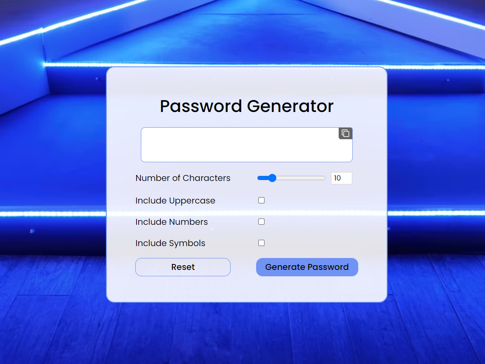

# 🔑 Password Generator App

This is a password generator app built using HTML, CSS and JavaScript.

### ⭐ Features:

The user can:
* Choose the length of the password (1-50)
* Choose the characters in the password
    * lowercase characters (default)
    * uppercase characters
    * numbers
    * symbols
* Copy the generated password with a single click using the **Copy Button** on the top-right of the password display.
* Reset the whole app with the **Reset Button**.

### 💻 Deployed At:

#### https://passwordgenerator-anushkachauhan.surge.sh

